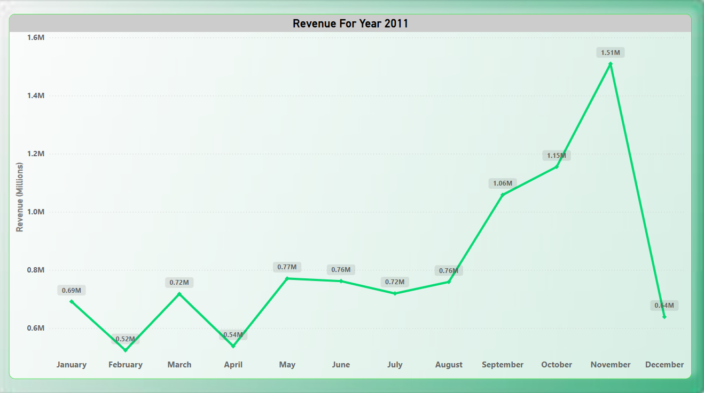
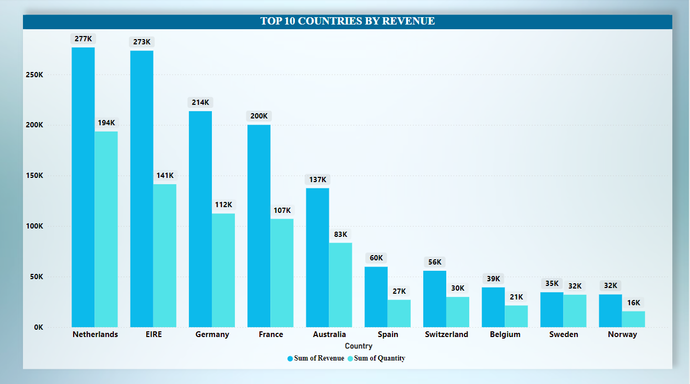
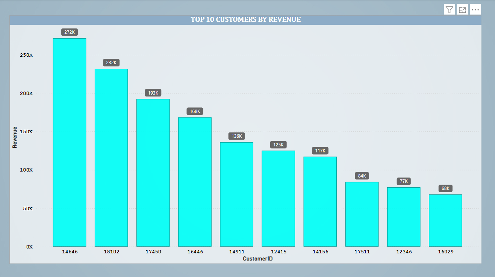
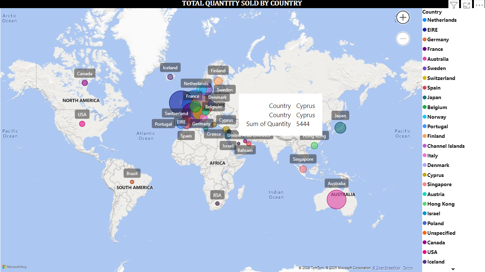

# Tata-Data-Visualization-Empowering-Business-with-Effective-Insights
This repository contains my project work from the **Tata Group Data Visualization Virtual Internship (Forage)**.  
It includes task-wise explanation, Power BI dashboard files, and insights generated from the Online Retail dataset.

---

## 📌 Task 1 – Anticipating CEO & CMO questions
- Framed 4 questions for the CEO focusing on revenue trends, growth opportunities, and high-value customers.  
- Framed 4 questions for the CMO focusing on market segmentation, customer engagement, and regional targeting.  

---

## 📌 Task 2 – Choosing effective visuals
- Matched different business scenarios with the most suitable charts (line, bar, map, table).  
- Learned the importance of selecting visuals based on the type of business question.  

---

## 📌 Task 3 – Power BI Dashboard
- Built an interactive Power BI file with **4 dashboards (sheets):**  
  1. **Revenue Trend** – Monthly sales trend for 2011, peak at **1.47M in November**  
  2. **Top 10 Countries** – Netherlands, Ireland, Germany, France contributed significantly besides UK  
  3. **Top 10 Customers** – Top customer generated **≈ 274K revenue**  
  4. **Geographic Spread** – Global sales distribution using a map  

---

## 📌 Task 4 – Communicating insights
- Prepared a video presentation summarizing insights.  
- Linked findings with leadership goals:  
  - **CEO** → Inventory planning, seasonal demand strategy, high-value customer retention  
  - **CMO** → Targeted marketing, loyalty programs, exploring new markets
 
  - ### 📷 Dashboard Visuals

  
  
  

---

## 🛠️ Tools & Skills
- Power BI (Data modeling, DAX, Dashboard design)  
- Business storytelling with data  
- Data cleaning & visualization 
